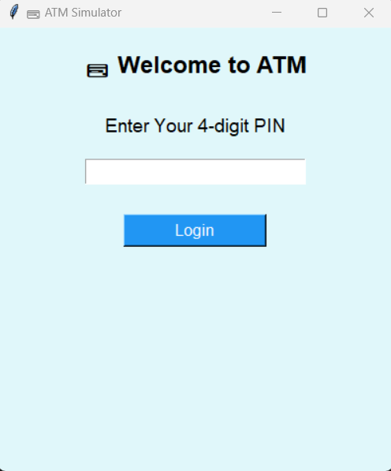
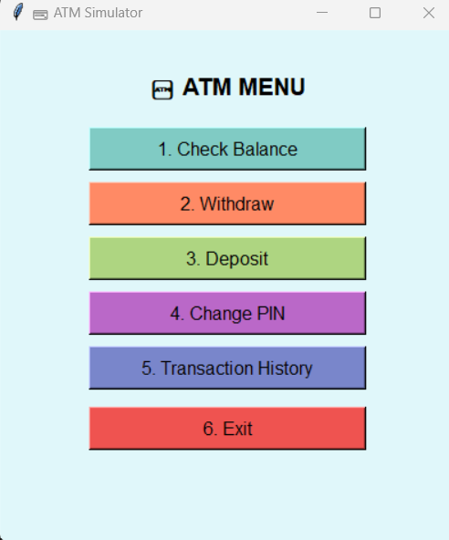

💳 ATM Simulator using Python and Tkinter

This project is a Graphical ATM Simulator application developed using Python and Tkinter. Built as part of my OctaNet Internship, it simulates real ATM operations like login, balance check, deposit, withdrawal, and PIN change — all in a neat GUI.

📸Screenshot

  

  

✅ Features

🔐 PIN-based Secure Login  
💰 Check Balance  
💵 Deposit Money  
💸 Withdraw Money  
🔁 Change PIN  
📜 Transaction History  
🎨 colorful and user-friendly GUI

🛠 Technologies Used

Python 
Tkinter (GUI Library)